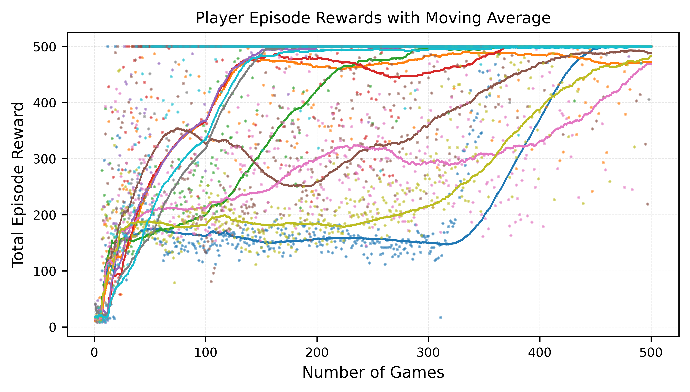
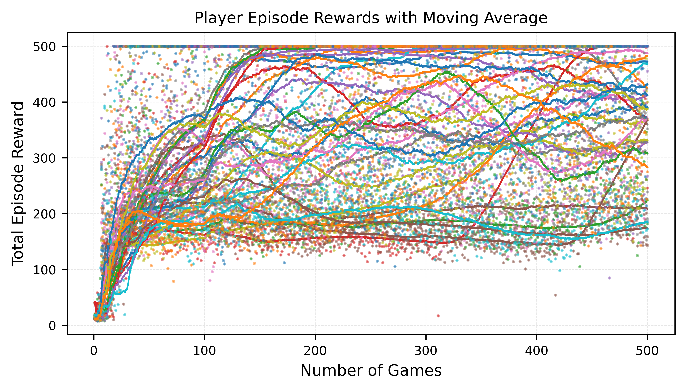

```markdown
# CartPole Toy Problem

This repository implements a learning algorithm that estimates state values in the **CartPole-v1** environment using a fixed horizon of 8 steps.

---

## Installation

1. **Clone the repository**:
   ```bash
   git clone https://github.com/melihiseri/cartpole-rl.git
   cd cartpole-rl
   ```

2. **Install dependencies**:
   ```bash
   pip install -r requirements.txt
   ```
   This will install all required Python packages.

---

## Usage

### 1. Training the Agent
To train multiple agents sequentially, run:
```bash
python -m CartPole_ToyModel.main
```
This will train **32 players** for **500 episodes each** and save the trained models in the current directory with filenames like:
```bash
model_PlayerID{player_id}_Episode{episode}.pth
```

### 2. Visualizing Training Performance
After training, generate a plot of rewards over training episodes:
```bash
python visualization.py
```
The plot will be saved as `rewards_plot.pdf`.

---

## Hyperparameters

### **General Training Parameters (`main.py`)**
- `N_Player`: Number of agent instances to train (default 32).
- `num_episodes`: Number of episodes per agent (default 500).

### **Neural Network and Memory Settings (`player.py`)**
- `T`: Time-horizon length for each action sequence.
- `N_SVE_nets`: Number of State Value Estimator networks.
- `SVE_size`, `SVE_depth`, `p_drop_SVE`: Define the internal architecture of each network.
- `stateaction_memory_size`, `max_memory`: Memory sizes.

Let us note that there many other internal parameters that can be adjusted.

---

## Project Structure
```
cartpole-rl/
│── main.py              # Trains multiple players
│── player.py            # Defines the Player class (agent)
│── networks.py          # Implements State Value Estimator (SVE) networks
│── memory.py            # Memory class
│── transition.py        # Implements CartPole state transition functions
│── utils.py             # Utility functions (e.g., set_seed, regret analysis)
│── visualization.py     # Plots training performance
│── experiments/         # Directory for trained models
```

---

## Results

Rewards plot for the top 10 models:
  

Rewards plot over 32 models:
  

---

## Important Notes on Training Stability

This approach is written for the initial learning phase, where memory management, regret analysis, and network training is aimed for early-stage learning dynamics. However, later crudely tuned to stabilize learning.

---

## References
- OpenAI Gym: [CartPole-v1](https://www.gymlibrary.ml/environments/classic_control/cart_pole/)
- Gymnasium: [gymnasium.farama.org](https://gymnasium.farama.org/)
- PyTorch: [pytorch.org](https://pytorch.org/)

---

## License
This project is licensed under the Creative Commons License. See the [LICENSE](./LICENSE) file for details.


---

## Author

Melih Iseri

---
